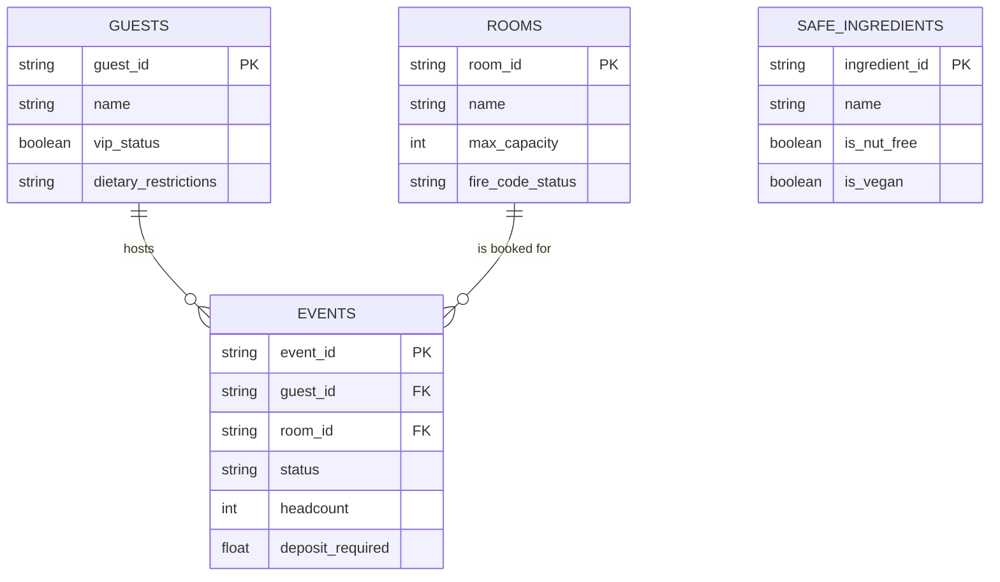

# Aurelia Hotels & Resorts — The BEO Assistant

**A safety-first Model Context Protocol (MCP) server for Banquet Event Order management.**
This repository implements a safety-oriented Banquet Event Order (BEO) assistant built around an MCP server, a SQLite-backed factual domain model, and a retrieval stack that can operate in Naive RAG, Hybrid RAG, and Agentic RAG modes.tual domain model, and a retrieval stack that can operate in Naive RAG, Hybrid RAG, and Agentic RAG modes.

The code now covers four primary areas:

- An MCP server that exposes resources, prompts, and tools over stdio transport.
- A SQLite schema and seed data for rooms, guests, events, and safe dietary ingredients.
- A client-side demo/agent loop that talks to the MCP server and the Groq LLM API.
- Retrieval, embedding, memory, and evaluation layers for RAG quality and context selection experiments.

## 2. Entity-Relationship Diagram (ERD)

The SQLite database in the repository is the operational data layer for the agent's safety checks, room-capacity enforcement, guest dietary constraints, event deposit workflow, and retrieval-backed menu reasoning. The current Mermaid schema is stored in [db/schema.mermaid](db/schema.mermaid) and is materialized through [db/setup_db.py](db/setup_db.py) into the local SQLite database file at [db/aurelia.db](db/aurelia.db) when the setup script is run.



## 3. Implementation of the MCP Protocol Surface

The current state of the project maps the MCP concepts to concrete runtime behavior in the server and client.

| # | Concern | Current implementation |
|---|---------|------------------------|
| 1 | **Capability Negotiation** | The client performs an `initialize` handshake through `ClientSession` and then queries the tool list from the server. The connection is intentionally stdio-based and designed to be read-only unless the requested LLM workflow is attached to the server. |
| 2 | **Notifications** | The server's director-authentication path flips server-side state so a higher-privilege tool exposure can be surfaced to the calling client. The low-level notification mechanism is wired through the MCP session and progress callback path. |
| 3 | **Elicitation** | The `confirm_event_booking` tool is conditionally exposed when the server is driven in the high-stakes demo mode and the director role is active. The client-side demo handles approval/rejection input around the high-value deposit flow. |
| 4 | **Resources** | The server exposes a policy resource at `aurelia://policies/fire-safety` through `list_resources()` / `read_resource()`. That resource communicates the room-capacity and fire-safety policy to the model. |
| 5 | **Prompts** | The server exposes a `draft_beo` prompt through `list_prompts()` and `get_prompt()`, returning a BEO-drafting prompt that can accept an `event_id` argument. |
| 6 | **Transport Choice** | The project is using the stdio transport at present, via `mcp.server.stdio` and `mcp.client.stdio`. This is aligned with the local server/client demo and evaluation flow. |
| 7 | **Progress Tracking** | `audit_chain_wide_availability` loops over the room table and emits progress notifications using the MCP request context progress token while it checks the full room inventory. |
| 8 | **Defensive Tool Design** | The `book_event_room` tool validates JSON arguments against a strict schema and also checks the database-backed room capacities and `fire_code_status` values before any booking write is accepted. |
| 9 | **Sampling** | The menu-generation path relies on the Groq LLM and the safe-ingredient facts from the SQLite store. That flow asks the client-side LLM to reason over the ingredient correctness rather than trusting a free-form text generation path. |

## 4. Tools & Capabilities

The current MCP server register exposes the following operational surface through the `list_tools()` contract.

| Tool Name | Type | Requires Elicitation? | Current Behavior |
|---|---|---|---|
| `audit_chain_wide_availability` | Read / Batch Audit | No | Counts the room inventory and reports sampled room capacity facts while pushing progress notifications. |
| `book_event_room` | Write / Safety Guard | No | Validates request shape and rejects over-capacity requests that violate the fire-code room policy. |
| `authenticate_director` | Write / State Change | No | Changes the director-authenticated server-side state used to gate the high-risk tool surface. |
| `draft_custom_menu` | Read / Compute | No | Pulls safe, database-backed ingredients and routes the result through the client-side reasoning loop. |
| `view_event_deposit_status` | Read | No | Returns the current deposit status and open event bookkeeping facts. |
| `confirm_event_booking` | High-Stakes Write | Yes | Exposed only in the main demonstration flow when the director state and elicitation-capable client context are both active. |

## 5. Current Architecture

The project is not limited to the original one-shot demo surface. The current repository has the following runtime parts:

- MCP server implementation in [mcp_server/server.py](mcp_server/server.py)
- Agent/demo orchestration in [agent/client.py](agent/client.py)
- Vector embedding and ANN-backed storage in [rag/embedder.py](rag/embedder.py) and [rag/vector_store.py](rag/vector_store.py)
- Retrieval variants in [rag/retrievers.py](rag/retrievers.py)
- Self-RAG verifier in [rag/self_rag.py](rag/self_rag.py)
- Memory system in [memory/short_term.py](memory/short_term.py), [memory/semantic_store.py](memory/semantic_store.py), [memory/episodic_store.py](memory/episodic_store.py), [memory/consolidation.py](memory/consolidation.py), and [memory/router.py](memory/router.py)
- SQLite seed setup in [db/setup_db.py](db/setup_db.py)

## 6. Data and Retrieval Modules

The SQLite database ships with a small domain schema and seed records for BEO operations:

- Rooms with capacity and fire-code safety metadata
- Guests with VIP and dietary restrictions
- Events with status and deposit requirements
- Safe ingredients used for menu generation constraints

The RAG plane includes a sentence-transformers embedding wrapper, a SQLite + BallTree vector store, a BM25 scorer, and retriever classes that expose the main retrieval strategies.


## 7. Context Strategy Evaluation
 
The repository ships a deterministic evaluator that rewinds the full BEO recall suite through the four pruning strategies and records objective evidence for the production context choice.
 
### Commands
 
```bash
python context_eval/evaluate.py
python planning_eval/evaluate_planning.py
```
 
That command loads the test corpus from the suite file, applies the four context-selection strategies, checks whether the critical operational fact survives after pruning, and writes a markdown comparison table to `context_eval/comparison_table.md`.
 
The scorecard has the required columns:
 
- Task accuracy after pruning
- Tokens consumed
- Latency
This table is the artifact that justifies whatever production context strategy the team selects after the evidence is collected.
 
## 8. Retrieval Architecture Comparison
 
We evaluated three retrieval architectures (Naive RAG, Hybrid Search, and Agentic RAG) across our domain-specific test questions (`q1_capacity_trap`, `q2_allergy_trap`, `q3_deposit_trap`, and `q4_general_room`):
 
| Architecture | Accuracy (Test Set) | Avg. Latency / Query | Self-RAG Verification Status |
| :--- | :--- | :--- | :--- |
| **Naive RAG** (Baseline Vector Search) | 4/4 (Pass) | ~0.06s | Mostly Pass / Pass |
| **Hybrid Search** (Vector + BM25) | 4/4 (Pass) | ~0.07s | Pass / Mix (Pass/Fail) |
| **Agentic RAG** (Multi-step Reasoning) | 4/4 (Pass) | ~1.80s | Pass / Mix (Pass/Fail) |
 
### **Justification & Architecture Selection:**
* **Performance Analysis:** All three architectures successfully achieved a **Pass** in accuracy across our core test questions. However, **Naive RAG** and **Hybrid Search** maintained extremely fast response times (averaging around `0.06s` to `0.07s`), whereas **Agentic RAG** suffered from a significantly higher latency (reaching up to `4.97s` on complex queries due to LLM reasoning loops).
* **Final Ship Decision:** We ship **Hybrid Search** as our default production retrieval layer. It provides robust keyword and vector coverage at minimal latency, avoiding the heavy performance overhead of multi-step agentic loops during live front-desk operations.


## Local Setup

### Prerequisites

- Python 3.10+
- A Groq API key and an environment that can reach the Groq service

### Install

```bash
python -m venv .venv
source .venv/bin/activate
pip install -r requirements.txt
```

### Environment variables

Create a root-level `.env` file with at least the following values:

```bash
GROQ_API_KEY=your_groq_api_key
MODEL_NAME=llama-3.3-70b-versatile
EMBEDDING_MODEL=sentence-transformers/all-MiniLM-L6-v2
```

### Initialize the database

```bash
python db/setup_db.py
```

### Run the demo client

```bash
python agent/client.py
```

The agent client drives the MCP server over stdio and exercises the tools, prompts, policies, and tool-calling loop.

## Evaluation and Tests

Several subprojects use deterministic evaluation and unittest-style regression coverage:

```bash
python context_eval/evaluate.py
python -m unittest discover
```

The context evaluation flow compares strategy outputs and writes artifacts to the context evaluation folder. The retrieval test suite validates the vector store and retriever implementations.

## Repository Layout

```text
agent/
context_eval/
db/
mcp_server/
memory/
rag/
retrieval_eval/
README.md
requirements.txt
```

## Notes

This repository is configured as a research-and-demo codebase rather than a packaged API service. The dependencies and runtime surface are intentionally close to the current Python implementation, including the Groq integration used by the client and the retrieval components.
