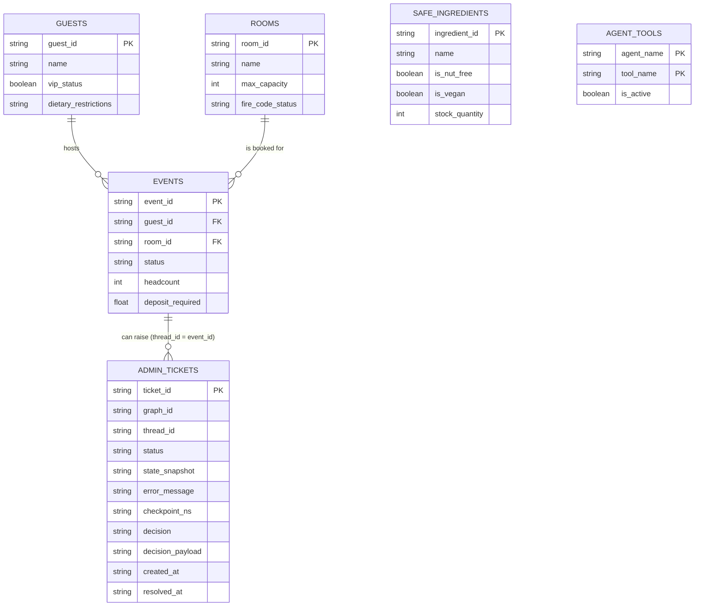

# Aurelia Hotels & Resorts — The BEO Assistant

**A safety-first Model Context Protocol (MCP) server for Banquet Event Order management.**
This repository implements a safety-oriented Banquet Event Order (BEO) assistant built around an MCP server, a SQLite-backed factual domain model, and a retrieval stack that can operate in Naive RAG, Hybrid RAG, and Agentic RAG modes.

**[Click here for the Step-by-Step Live Demo & Quick Start Guide](DEMO.md)**

The code now covers seven primary areas:

- An MCP server that exposes resources, prompts, and tools over stdio **and HTTP/SSE** transport, with runtime tool enable/disable driven from the admin platform.
- A SQLite schema and seed data for rooms, guests, events, safe dietary ingredients, agent-tool assignments, and admin tickets.
- A client-side demo/agent loop that talks to the MCP server and the Groq LLM API.
- Retrieval, embedding, memory, and evaluation layers for RAG quality and context selection experiments.
- A separate Planning Agent that decomposes goals into task graphs and routes sub-tasks across four planning/search strategies (Plan-and-Solve, Tree of Thoughts, Reflexion, LATS), evaluated against the same live MCP tools.
- **Three persistent, checkpointed LangGraph state-graph agents** (`state_graph/`) that hold state across turns, pause on human-in-the-loop decisions, and recover from unplanned failures without losing progress (see [§10](#10-state-graphs-checkpointing--human-in-the-loop)).
- **A working admin + user platform** (`platform/`) — a FastAPI backend and Next.js frontend — that is the only way a real user or admin reaches any of the agents above (see [§11](#11-the-platform)).

## Contents

1. [Entity-Relationship Diagram (ERD)](#2-entity-relationship-diagram-erd)
2. [Implementation of the MCP Protocol Surface](#3-implementation-of-the-mcp-protocol-surface)
3. [Tools & Capabilities](#4-tools--capabilities)
4. [Current Architecture](#5-current-architecture)
5. [Data and Retrieval Modules](#6-data-and-retrieval-modules)
6. [Context Strategy Evaluation](#7-context-strategy-evaluation)
7. [Retrieval Architecture Comparison](#8-retrieval-architecture-comparison)
8. [Planning Agent & Multi-Strategy Task Planning](#9-planning-agent--multi-strategy-task-planning)
9. [State Graphs, Checkpointing & Human-in-the-Loop](#10-state-graphs-checkpointing--human-in-the-loop)
10. [The Platform](#11-the-platform)
11. [Corrections Carried Over From Prior Labs](#12-corrections-carried-over-from-prior-labs)
12. [Known Limitations](#13-known-limitations)
13. [Local Setup](#local-setup)
14. [Evaluation and Tests](#evaluation-and-tests)
15. [Repository Layout](#repository-layout)
16. [Notes](#notes)

## 2. Entity-Relationship Diagram (ERD)

The SQLite database in the repository is the operational data layer for the agent's safety checks, room-capacity enforcement, guest dietary constraints, event deposit workflow, retrieval-backed menu reasoning, **and now the state-graph platform's runtime tool registry and admin ticket queue**. The current Mermaid schema is stored in [db/schema.mermaid](db/schema.mermaid) and is materialized through [db/setup_db.py](db/setup_db.py) into the local SQLite database file at `db/aurelia.db` when the setup script is run. The same file also holds the LangGraph checkpoint tables (`SqliteSaver.setup()` / `AsyncSqliteSaver`) that back every state graph in [§10](#10-state-graphs-checkpointing--human-in-the-loop) — checkpointing is not a separate database, it lives in `aurelia.db` alongside the domain tables below.



Two tables are new for the final project:

- **`agent_tools`** — one row per `(agent_name, tool_name)` pair, with an `is_active` flag. [mcp_server/server.py](mcp_server/server.py) queries this table fresh on every `list_tools()` / `call_tool()` call, so the admin platform ([§11](#11-the-platform)) can enable or disable a tool for a live agent without redeploying the server. A tool is only treated as disabled if *every* row for that `tool_name` has `is_active = 0`, and the table is fail-open (an untracked or empty table never hides the whole tool surface).
- **`admin_tickets`** — one row per HITL pause or unplanned failure, keyed by `ticket_id`, with `graph_id` + `thread_id` identifying which state-graph thread it belongs to. `status` is one of `pending_admin` (HITL, expected pause), `open` (unplanned failure), or `resolved`. `thread_id` is loosely tied to `events.event_id` in the diagram above because every state graph in this repo uses the event ID as its LangGraph thread ID, but it is not a SQL foreign key since a graph is free to use a different thread-id scheme.

## 3. Implementation of the MCP Protocol Surface

The current state of the project maps the MCP concepts to concrete runtime behavior in the server and client.

| # | Concern | Current implementation |
|---|---------|------------------------|
| 1 | **Capability Negotiation** | The client performs an `initialize` handshake through `ClientSession` and then queries the tool list from the server. The connection is intentionally stdio-based and designed to be read-only unless the requested LLM workflow is attached to the server. |
| 2 | **Notifications** | The server's director-authentication path flips server-side state so a higher-privilege tool exposure can be surfaced to the calling client. The low-level notification mechanism is wired through the MCP session and progress callback path. |
| 3 | **Elicitation** | The `confirm_event_booking` tool is conditionally exposed when the server is driven in the high-stakes demo mode and the director role is active. The client-side demo handles approval/rejection input around the high-value deposit flow. |
| 4 | **Resources** | The server exposes a policy resource at `aurelia://policies/fire-safety` through `list_resources()` / `read_resource()`. That resource communicates the room-capacity and fire-safety policy to the model. |
| 5 | **Prompts** | The server exposes a `draft_beo` prompt through `list_prompts()` and `get_prompt()`, returning a BEO-drafting prompt that can accept an `event_id` argument. |
| 6 | **Transport Choice** | The project is using the stdio transport at present, via `mcp.server.stdio` and `mcp.client.stdio`. This is aligned with the local server/client demo and evaluation flow, and is also what both the RAG agent and the Planning Agent spawn their MCP sessions over. |
| 7 | **Progress Tracking** | `audit_chain_wide_availability` loops over the room table and emits progress notifications using the MCP request context progress token while it checks the full room inventory. |
| 8 | **Defensive Tool Design** | The `book_event_room` tool validates JSON arguments against a strict schema and also checks the database-backed room capacities and `fire_code_status` values before any booking write is accepted. |
| 9 | **Sampling** | The menu-generation path relies on the Groq LLM and the safe-ingredient facts from the SQLite store. That flow asks the client-side LLM to reason over the ingredient correctness rather than trusting a free-form text generation path. |

## 4. Tools & Capabilities

The current MCP server register exposes the following operational surface through the `list_tools()` contract.

| Tool Name | Type | Requires Elicitation? | Current Behavior |
|---|---|---|---|
| `audit_chain_wide_availability` | Read / Batch Audit | No | Counts the room inventory and reports sampled room capacity facts while pushing progress notifications. |
| `book_event_room` | Write / Safety Guard | No | Validates request shape and rejects over-capacity requests that violate the fire-code room policy. |
| `authenticate_director` | Write / State Change | No | Changes the director-authenticated server-side state used to gate the high-risk tool surface. |
| `draft_custom_menu` | Read / Compute | No | Pulls safe, database-backed ingredients and routes the result through the client-side reasoning loop. |
| `view_event_deposit_status` | Read | No | Returns the current deposit status and open event bookkeeping facts. |
| `confirm_event_booking` | High-Stakes Write | Yes | Exposed only in the main demonstration flow when the director state and elicitation-capable client context are both active. |

These same six tools are the surface both `agent/client.py` (the RAG/memory agent) and `agent/planning_client.py` (the Planning Agent) call into — the tool implementations live in one place ([mcp_server/server.py](mcp_server/server.py)), and each agent spawns its own short-lived MCP server subprocess against it.

## 5. Current Architecture

The project is not limited to the original one-shot demo surface. The current repository has the following runtime parts:

- MCP server implementation in [mcp_server/server.py](mcp_server/server.py)
- Agent/demo orchestration in [agent/client.py](agent/client.py)
- Planning Agent orchestration in [agent/planning_client.py](agent/planning_client.py), [agent/planning_agent_executor.py](agent/planning_agent_executor.py), and [agent/planning_router.py](agent/planning_router.py) (see [§9](#9-planning-agent--multi-strategy-task-planning))
- Vector embedding and ANN-backed storage in [rag/embedder.py](rag/embedder.py) and [rag/vector_store.py](rag/vector_store.py)
- Retrieval variants in [rag/retrievers.py](rag/retrievers.py)
- Self-RAG verifier in [rag/self_rag.py](rag/self_rag.py)
- Memory system in [memory/short_term.py](memory/short_term.py), [memory/semantic_store.py](memory/semantic_store.py), [memory/episodic_store.py](memory/episodic_store.py), [memory/consolidation.py](memory/consolidation.py), and [memory/router.py](memory/router.py)
- SQLite seed setup in [db/setup_db.py](db/setup_db.py)

## 6. Data and Retrieval Modules

The SQLite database ships with a small domain schema and seed records for BEO operations:

- Rooms with capacity and fire-code safety metadata
- Guests with VIP and dietary restrictions
- Events with status and deposit requirements
- Safe ingredients used for menu generation constraints

The RAG plane includes a sentence-transformers embedding wrapper, a SQLite + BallTree vector store, a BM25 scorer, and retriever classes (`NaiveRAG`, `HybridRAG`, `AgenticRAG`) that expose the main retrieval strategies.

[populate_rag.py](populate_rag.py) is a standalone utility script that seeds a small BEO knowledge-base corpus (the ballroom capacity policy, the VIP guest's dietary constraints, the EVT_999 deposit fact, and the safe-ingredients list) into a `VectorStore`. It is the same corpus that [retrieval_eval/evaluate_rag.py](retrieval_eval/evaluate_rag.py) queries against when scoring Naive/Hybrid/Agentic RAG. It is independent of the live `agent/client.py` demo loop, which opens its own (separately initialized) vector store at `db/rag_store.sqlite`.

## 7. Context Strategy Evaluation

The repository ships a deterministic evaluator that rewinds the full BEO recall suite through the four pruning strategies and records objective evidence for the production context choice.

### Commands

```bash
python context_eval/evaluate.py
```

That command loads the test corpus from the suite file, applies the four context-selection strategies, checks whether the critical operational fact survives after pruning, and writes a markdown comparison table to `context_eval/comparison_table.md`.

The scorecard has the required columns:

- Task accuracy after pruning
- Tokens consumed
- Latency

This table is the artifact that justifies whatever production context strategy the team selects after the evidence is collected.

## 8. Retrieval Architecture Comparison

We evaluated three retrieval architectures (Naive RAG, Hybrid Search, and Agentic RAG) across our domain-specific test questions (`q1_capacity_trap`, `q2_allergy_trap`, `q3_deposit_trap`, and `q4_general_room`):

| Architecture | Accuracy (Test Set) | Avg. Latency / Query | Self-RAG Verification Status |
| :--- | :--- | :--- | :--- |
| **Naive RAG** (Baseline Vector Search) | 4/4 (Pass) | ~0.06s | Mostly Pass / Pass |
| **Hybrid Search** (Vector + BM25) | 4/4 (Pass) | ~0.07s | Pass / Mix (Pass/Fail) |
| **Agentic RAG** (Multi-step Reasoning) | 4/4 (Pass) | ~1.80s | Pass / Mix (Pass/Fail) |

### **Justification & Architecture Selection:**
* **Performance Analysis:** All three architectures successfully achieved a **Pass** in accuracy across our core test questions. However, **Naive RAG** and **Hybrid Search** maintained extremely fast response times (averaging around `0.06s` to `0.07s`), whereas **Agentic RAG** suffered from a significantly higher latency (reaching up to `4.97s` on complex queries due to LLM reasoning loops).
* **Final Ship Decision:** We ship **Hybrid Search** as our default production retrieval layer. It provides robust keyword and vector coverage at minimal latency, avoiding the heavy performance overhead of multi-step agentic loops during live front-desk operations.

## 9. Planning Agent & Multi-Strategy Task Planning

Alongside the RAG/memory agent, the repository has a second, independent agent that decomposes a natural-language goal into sub-tasks and executes them against the same six MCP tools, then audits which planning algorithm each sub-task *should* have used.

### 9.1 Two entry points, one MCP surface

- [agent/client.py](agent/client.py) — the original RAG/memory demo agent.
- [agent/planning_client.py](agent/planning_client.py) — the Planning Agent. It is a **deliberately separate process**: its own CLI, its own MCP stdio session (via [agent/planning_agent_executor.py](agent/planning_agent_executor.py)), and it never imports or calls into `agent/client.py`. The two agents share only the `mcp_server/` code and the on-disk `db/aurelia.db` — each spawns its own short-lived server subprocess, and both can run at once in separate terminals without conflicting.

### 9.2 Planning strategies

`PlanningAgentExecutor` runs a goal through one of two grounded modes, both backed by `ChatGroq` (`MODEL_NAME`, default `llama-3.3-70b-versatile`):

- **`decomposition` (default):** builds a full task DAG up front (`decompose_goal_grounded`), validates it (acyclicity, id/dependency checks via NetworkX + Pydantic), then executes it step by step against the live MCP tools (`execute_plan_against_mcp`).
- **`dynamic`:** interleaves planning and observation one step at a time (`dynamic_decomposition_grounded`), capped by `--max-steps`.

Underneath both, [planning/planning_lab/algorithms/](planning/planning_lab/algorithms) implements the full set of planning/search techniques the project explores:

| Algorithm | Module | Idea |
|---|---|---|
| Decomposition (static DAG) | `decomposition.py` | Upfront task-graph generation, topological scheduling, parallel-safe batches |
| Dynamic decomposition | `dynamic_decomposition.py` | Plan one step, observe the tool result, then plan the next step |
| Plan-and-Solve (PS) | `plan_and_solve.py` | Single explicit plan phase followed by a solution phase — lowest cost, linear tasks |
| Tree of Thoughts (ToT) | `tree_of_thoughts.py` | Bounded generate/evaluate/beam-search over candidate states |
| Self-Refine | `self_refine.py` | One draft, one critique pass, one revision |
| Reflexion | `reflexion.py` | Retries a task across trials, carrying bounded verbal episodic memory of prior failures |
| LATS | `lats.py` | Compact MCTS loop — action generation, a value function, external environment feedback, branch reflection, UCT selection, value backpropagation |
| Environment | `environment.py` | Swappable external feedback interface used by Reflexion/LATS |

Demo scripts wiring each technique to the actual Aurelia domain (booking, breakout-room selection, conference planning) live in [planning/aurelia_adapters/](planning/aurelia_adapters): `booking_reflexion_demo.py`, `breakout_tot_demo.py`, `conference_dag_demo.py`, and `conference_dynamic_demo.py`. [planning/README.md](planning/README.md) documents the original standalone lab (CLI, exercises) that these algorithms were built from.

### 9.3 Planning Router (audit layer)

[agent/planning_router.py](agent/planning_router.py) implements a `PlanningRouter` that inspects each executed sub-task's instruction text (allergy/VIP signals, combinatorial-selection signals, capacity-violation/retry signals, arithmetic/deterministic signals) and reports, with a confidence score and rationale, which of the four algorithms (PS / ToT / Reflexion / LATS) *should* have handled it — e.g. an allergy- or VIP-related menu step routes to LATS, a "select K distinct rooms" step routes to ToT, a capacity-retry step routes to Reflexion, and deposit/budget arithmetic routes to PS by default. This is an **advisory audit trail only**: it runs after execution and does not change which code path actually ran the step. `agent/planning_client.py` prints this audit for every step of a run.

### 9.4 Planning comparison table

[planning_eval/evaluate_planning.py](planning_eval/evaluate_planning.py) runs the full comparison suite ([planning_eval/test_suite.json](planning_eval/test_suite.json)) across Static DAG, Dynamic Decomposition, Plan-and-Solve, Tree of Thoughts, Reflexion, and LATS, instrumenting real LLM-call counts, estimated tokens, latency, and an approximate Groq cost per algorithm. It writes a raw run trace to `planning/artifacts/`, refreshes [planning_eval/comparison_table.md](planning_eval/comparison_table.md), and re-embeds the table below between the `PLANNING_EVAL_TABLE` markers in this README.

```bash
python planning_eval/evaluate_planning.py
```

<!-- PLANNING_EVAL_TABLE_START -->
| Algorithm | Accuracy | LLM Calls | Tokens | Avg Latency (s) | Est. Cost (USD) |
|---|---:|---:|---:|---:|---:|
| Static DAG | 75.0% (3/4) | 17 | 4481 | 10.077 | $0.0031 |
| Dynamic Decomposition | 25.0% (1/4) | 25 | 11011 | 22.906 | $0.0076 |
| Plan-and-Solve | 75.0% (3/4) | 4 | 1343 | 2.078 | $0.0009 |
| Tree of Thoughts | 50.0% (2/4) | 12 | 849 | 6.354 | $0.0006 |
| Reflexion | 75.0% (3/4) | 9 | 2032 | 3.167 | $0.0014 |
| LATS | 50.0% (2/4) | 5 | 486 | 3.514 | $0.0003 |
<!-- PLANNING_EVAL_TABLE_END -->

## 10. State Graphs, Checkpointing & Human-in-the-Loop

The Planning Agent's task graphs in [§9](#9-planning-agent--multi-strategy-task-planning) are DAGs: acyclic, and finished the moment the topological order runs out. A lot of real front-desk work does not fit that shape — it waits on people and on external systems, it can be rejected and reworked, and losing progress on a crash is not acceptable. [state_graph/](state_graph) adds three persistent LangGraph state machines for exactly those cases, sitting next to (and reusing) the same `mcp_server/` and `db/aurelia.db` the rest of the repo already uses.

### 10.1 Why these three problems needed a state graph and not a DAG

| Graph | Module | Why a single pass can't solve it | Two LLM-call additions |
|---|---|---|---|
| **VIP Dietary Handoff** | [state_graph/vip_dietary.py](state_graph/vip_dietary.py) | A severe-allergy menu can't be chosen once and trusted — the agent has to search candidate pairings, verify each against live kitchen stock, back out and try again when a candidate is out of stock, and an Executive Chef must sign off before anything is confirmed. A single LLM pass has no way to retry against a changing stock count or to be vetoed by a human. | LATS-style iterative search (an LLM judges each candidate pairing) + **[see §13](#13-known-limitations) — a second addition is not yet wired in.** |
| **Post-Event Billing Dispute** | [state_graph/billing_dispute.py](state_graph/billing_dispute.py) | Resolving a disputed invoice is a negotiation, not a lookup — it spans multiple client replies over multiple sittings, it can go through several rounds before either side is satisfied, and a deadlocked negotiation has to escalate to a human rather than loop forever. | Task Decomposition (reconciliation split into pull-facts / compute-expected / diff subtasks) + Tree-of-Thoughts-style candidate scoring for the negotiation email (see [§13](#13-known-limitations) for a note on why these two are currently deterministic rather than LLM calls). |
| **Vendor Logistics** | [state_graph/vendor_logistics.py](state_graph/vendor_logistics.py) | Ordering from an external vendor means sending a request and then genuinely waiting — sometimes for hours — for their reply, which arrives asynchronously through a webhook, not a return value. A quote over budget must not be accepted automatically, and a vendor who can't meet the budget after a bounded number of renegotiation rounds is a real failure, not something a retry fixes. | RAG (vendor policies retrieved before drafting the request) + Task Decomposition (the logistics goal is decomposed and executed via `planning/planning_lab/algorithms/decomposition.py`), both driving real LLM calls. |

### 10.2 Shape of each graph

**VIP Dietary Handoff** (`vip_dietary_agent`):

```
fetch_guest_constraints -> lats_search <--> inventory_check
                                 |                  |
                                 v                  v
                          ticket_exhausted   chef_signoff (pauses here)
                                                     |
                                            record_chef_decision
                                              /            \
                                        confirmed      lats_search (retry)
```

`lats_search` and `inventory_check` form a genuine intra-run cycle: a candidate pairing that fails the stock check is added to `tried_combos` and control returns to `lats_search` for the next candidate, with no re-execution of the guest-constraints lookup that already completed. The graph is compiled with `interrupt_before=["record_chef_decision"]`, so as soon as a stocked, LLM-approved pairing is found, execution pauses and a `pending_admin` ticket opens for the Executive Chef. If every combination in the candidate pool is exhausted without a stocked, chef-approved pairing, `ticket_exhausted` opens a real `open` failure ticket instead of looping forever.

**Post-Event Billing Dispute** (`billing_dispute`):

```
generate_invoice -> reconcile_ledger -> [client ACCEPTED] -> finalize_billing -> END
                                       -> [client DISPUTED, round < 3] -> draft_dispute_email -> END (turn)
                                       -> [client REJECTED_FINAL, or 3 rounds exhausted]
                                              -> escalate_to_finance (pauses here) -> human_finance_review -> finalize_billing -> END
```

Every turn is a separate `run_turn(...)` call against the same `thread_id = event_id`, so the negotiation genuinely spans multiple sittings — the client can come back hours later and the graph picks up exactly where the reconciliation and round count left off, driven entirely by the persisted checkpoint rather than anything held in memory. `MAX_NEGOTIATION_ROUNDS = 3` bounds the negotiation before it is treated as deadlocked and escalated.

**Vendor Logistics** (`vendor_logistics`):

```
research_and_plan -> draft_and_send -> wait_for_vendor_reply (pauses here; resumes on vendor webhook)
                                              |
                                    [proposal > budget] -> hitl_approval (pauses here)
                                              |                    |
                                    [proposal <= budget]    [approved] -> finalize -> END
                                              |                    |
                                          finalize -> END   [rejected, retries < 2] -> draft_and_send (retry)
                                                                    |
                                                            [rejected, retries == 2] -> ticketed failure -> END
```

`wait_for_vendor_reply` is where the graph genuinely sleeps: [simulate_vendor.py](simulate_vendor.py) plays the part of an external webhook, writing a quote directly into the paused thread's checkpoint via `aupdate_state()` and then resuming it with `ainvoke(None, config)` — no polling, no busy-loop, the process is free to do other work while a thread waits. An admin who rejects an over-budget quote sends the graph back to `draft_and_send` for another round with the vendor (`retry_count`, capped at `MAX_RENEGOTIATION_ROUNDS = 2`) rather than failing the booking outright; only once renegotiation is genuinely exhausted does this become a real, ticketed failure distinct from the earlier HITL pause.

### 10.3 Checkpointing

[state_graph/checkpointer.py](state_graph/checkpointer.py) exposes a single `get_checkpointer()` async context manager wrapping `AsyncSqliteSaver`, pointed at the same `db/aurelia.db` file `db/setup_db.py` already prepares checkpoint tables in. Every graph in `state_graph/` compiles against this checkpointer (or, for `billing_dispute`, a `SqliteSaver` against the same file), so a write happens after every meaningful transition, not only at the end of a run.

To prove crash-and-resume rather than just claim it:

```bash
python db/setup_db.py
python -m state_graph.billing_dispute        # runs turns 1-3, pauses at human_finance_review
# ^C the process here, mid-run, before the resume call
python -m state_graph.billing_dispute        # re-run: aget_state() shows the same paused thread,
                                              # `next` still points at human_finance_review, and
                                              # resume_after_finance_review picks up from exactly
                                              # that checkpoint -- generate_invoice and
                                              # reconcile_ledger are NOT re-executed.
```

### 10.4 HITL vs. failure tickets

[state_graph/hitl.py](state_graph/hitl.py) and [state_graph/tickets.py](state_graph/tickets.py) implement two deliberately separate code paths into the same `admin_tickets` table, distinguished by `status`:

- **`pending_admin` (HITL, expected pause)** — opened by `open_hitl_ticket(...)` from inside a node right before the graph hits an `interrupt_before` breakpoint (chef sign-off, finance escalation, over-budget vendor quote). `open_hitl_ticket` is idempotent per `(graph_id, thread_id)`, so a node whose body replays on resume never opens a duplicate ticket. The *only* way past the breakpoint is `state_graph.hitl.submit_admin_decision(ticket_id, decision, payload)`, called by `platform/admin_api.py`'s `POST /api/admin/tickets/{id}/decision` — it looks up which of the three graphs the ticket belongs to, writes the admin's decision into that thread's state with `aupdate_state()`, resumes with `ainvoke(None, updated_config)`, and only then marks the ticket `resolved`.
- **`open` (unplanned failure)** — [state_graph/recovery.py](state_graph/recovery.py)'s `with_error_handling(graph_id, node_name)` decorator wraps every node function in all three graphs. Any unhandled exception (a tool call erroring, an LLM returning something the graph can't parse) is caught, a ticket is raised via `raise_ticket(...)` with the pre-node state snapshot attached, and the exception is re-raised so the checkpointer's last-good checkpoint is what's left on disk — not a partially-applied node. `platform/admin_api.py`'s `POST /api/admin/tickets/{id}/resume` calls `state_graph.recovery.resume_from_ticket(ticket_id)`, which resolves the ticket and re-invokes the graph from that exact checkpoint.

## 11. The Platform

[platform/](platform) is a FastAPI backend ([main.py](platform/main.py), [admin_api.py](platform/admin_api.py), [chat_api.py](platform/chat_api.py)) plus a Next.js frontend ([app/](platform/app)) — the first real product surface in this repository. It talks to the same live `mcp_server/` (over HTTP/SSE) and the same `db/aurelia.db` as every other agent; it does not stand up a parallel server or database.

**Admin surface** (`platform/app/admin/`, backed by `/api/admin/*`):
- **Tool management** — `GET /api/admin/tools` lists every `(agent_name, tool_name, is_active)` row; `POST /api/admin/tools/toggle` flips one and best-effort notifies any already-open MCP session via `tools/list_changed`. Because `mcp_server/server.py` re-queries `agent_tools` on every `list_tools()`/`call_tool()` call, this reaches the live server without a redeploy.
- **RAG document management** — `POST /api/admin/rag/upload` and `DELETE /api/admin/rag/document/{id}` add/remove documents from the same `VectorStore` (`db/rag_store.sqlite`) that `agent/client.py`'s memory/RAG agent queries at chat time, so a change is reflected on the agent's next query rather than sitting unused in storage.
- **Tickets & HITL** — `GET /api/admin/tickets`, `GET /api/admin/tickets/{id}`, `POST /api/admin/tickets/{id}/decision` (HITL resolution), and `POST /api/admin/tickets/{id}/resume` (failure-ticket recovery) are the admin's only way into the state graphs' pause/failure paths — see [§10.4](#104-hitl-vs-failure-tickets). The UI for this lives at `platform/app/admin/tickets/page.jsx`.

**User surface** (`platform/app/chat/`, backed by `/api/chat/*`, [chat_agents.py](platform/chat_agents.py), [chat_sessions.py](platform/chat_sessions.py)):
- `GET /api/chat/agents` returns the agent catalog (memory/RAG, Planning, and the three state graphs) that drives the agent switcher.
- `POST /api/chat/sessions` starts a session against whichever agent the user picked; `POST /api/chat/sessions/{id}/message` sends a turn.
- For the three state-graph agents specifically, `GET /api/chat/sessions/{id}` re-checks the persisted LangGraph thread on every refresh, so a HITL decision an admin makes out-of-band shows up in the user's chat as a real update ("Confirmed dishes...", "Waiting on ticket TICKET_### — checking automatically") rather than the UI silently going stale.

See [DEMO.md](DEMO.md) for the full three-terminal boot sequence and a step-by-step script for all three graphs against the live platform.

## 12. Corrections Carried Over From Prior Labs

Grading for this project covers the whole repository, not just `state_graph/` and `platform/`. Fixes made specifically because they are now load-bearing for the platform:

- **MCP capability negotiation** ([mcp_server/server.py](mcp_server/server.py), `_client_has_elicitation_capability`) previously read the `DEMO_MODE` environment variable directly, which only "worked" because the bundled demo client set it in lockstep with the capabilities it separately injected. Any other client — including the admin platform or the Planning Agent — would have inherited whatever `DEMO_MODE` happened to be set to on the server process, regardless of what it actually declared during `initialize()`. It now reads the real negotiated `ClientCapabilities` from the session, which is what capability negotiation is supposed to do.
- **RAG store path mismatch** — `platform/admin_api.py` was writing admin-uploaded/deleted documents to `db/rag_store.db`, while `agent/client.py`'s live RAG/memory agent reads from `db/rag_store.sqlite`. The two paths are now the same file, so an admin's document changes are actually visible to the agent on its next query, per the platform requirement in [§11](#11-the-platform) — this was previously silently broken (uploads succeeded but were never retrieved).
- **Runtime tool exposure** — the MCP server's tool surface was previously fixed at process start. `mcp_server/server.py` now queries the `agent_tools` table fresh on every `list_tools()`/`call_tool()` call, so the admin panel's tool toggle reaches the live server without a redeploy.

## 13. Known Limitations

Documented here deliberately rather than left for a grader to find:

- **`vip_dietary_agent` currently implements one of the required two LLM-call additions.** Its LATS-style candidate search calls the LLM for real; a second addition (RAG over allergy/menu protocol documents, or a constrained-ReAct step around the chef-notification/booking action, are the natural candidates) is not yet wired into a node. Flagged rather than hidden.
- **`billing_dispute`'s Task Decomposition and Tree-of-Thoughts nodes are currently deterministic, not LLM calls.** `reconcile_ledger` executes three fixed Python subtasks against the ledger, and `draft_dispute_email` scores three fixed email templates with a heuristic rather than an LLM judging or generating them. The decompose → execute → trace and generate → evaluate → select *shapes* match the two techniques; the actual reasoning inside each step does not yet call an LLM. This keeps the module deterministic and runnable without `GROQ_API_KEY`, but does not meet the letter of "LLM-call additions" as written in the assignment.
- **A few `state_graph/tests/` unit tests are stale, not indicative of a live-demo bug.** `state_graph/hitl.py`'s resume adapters were fixed to capture and use the updated checkpoint config returned by `aupdate_state()` (see the `# FIX:` comments in that file); `test_hitl.py` and `test_billing_dispute_hitl.py` still assert the pre-fix calling convention, and `test_vip_dietary_graph.py` still asserts on LangGraph's dynamic-`interrupt()` API (`task.interrupts`, `Command(resume=...)`) even though `vip_dietary_agent` pauses via the static `interrupt_before` mechanism instead. Manually driving the exact resume path `platform/admin_api.py` uses (`aupdate_state` + `ainvoke(None, updated_config)`) against a live graph confirms the underlying pause/resume behavior is correct; the four failing tests need their expectations updated to match, not the production code.

## Local Setup

### Prerequisites

- Python 3.10+
- A Groq API key and an environment that can reach the Groq service (used by both `agent/client.py` and the Planning Agent)

### Install

```bash
python -m venv .venv
source .venv/bin/activate
pip install -r requirements.txt
```

`requirements.txt` at the repo root already includes everything needed to run `mcp_server/`, `agent/` (both the RAG agent and the Planning Agent), and `planning/` together — including the Planning Agent's `langchain-groq`, `networkx`, and `pydantic` dependencies. [planning/requirements.txt](planning/requirements.txt) is kept only as an empty placeholder so a stray `pip install -r planning/requirements.txt` doesn't error out; you don't need to run it separately.

### Environment variables

Create a root-level `.env` file with at least the following values:

```bash
GROQ_API_KEY=your_groq_api_key
MODEL_NAME=llama-3.3-70b-versatile
EMBEDDING_MODEL=sentence-transformers/all-MiniLM-L6-v2
```

### Initialize the database

```bash
python db/setup_db.py
```

This creates and seeds the relational store at `db/aurelia.db` (rooms, guests, events, safe ingredients) used by every MCP tool.

### Run the demo client

```bash
python agent/client.py
```

The agent client drives the MCP server over stdio and exercises the tools, prompts, policies, and tool-calling loop.

### Run the planning agent

The Planning Agent is a **separate entry point**, [agent/planning_client.py](agent/planning_client.py). It runs
independently of `agent/client.py` — a different process with its own MCP stdio session — but shares the same
underlying resources: it spawns the same `mcp_server/` (`python -m mcp_server.server`) and that server reads/writes
the same on-disk `db/aurelia.db`. Nothing in `agent/client.py` is imported, called, or modified to make this work.

```bash
# Run with the built-in demo goal
python agent/planning_client.py

# Run with your own goal
python agent/planning_client.py "Plan a 2-day offsite for 60 people, confirm the deposit for EVT_999."

# Interleave planning and execution one step at a time instead of building the full DAG up front
python agent/planning_client.py "<goal>" --mode dynamic --max-steps 8
```

Both agents can be run separately, or at the same time in two terminals — each opens its own MCP server subprocess
and neither one depends on the other being started first.

### Run the platform (state graphs + admin/user UI)

The three state-graph agents in [§10](#10-state-graphs-checkpointing--human-in-the-loop) and the admin/user platform in [§11](#11-the-platform) need the MCP server running in HTTP mode plus the FastAPI backend and Next.js frontend, each in their own terminal. **[DEMO.md](DEMO.md) has the full boot sequence and a step-by-step script for all three graphs** (VIP Dietary, Billing Dispute, Vendor Logistics) against the live platform, including how to simulate the vendor webhook. In short:

```bash
# Terminal 1 -- MCP server, HTTP/SSE transport
set MCP_TRANSPORT=http && python -m mcp_server.server

# Terminal 2 -- FastAPI backend
cd platform && uvicorn main:app --port 8000 --reload

# Terminal 3 -- Next.js frontend
cd platform && npm install && npm run dev
```

Then open `http://localhost:3000/chat` (user) and `http://localhost:3000/admin` / `/admin/tickets` (admin).

## Evaluation and Tests

Several subprojects use deterministic evaluation and unittest/pytest-style regression coverage:

```bash
python context_eval/evaluate.py           # context-pruning strategy comparison (§7)
python retrieval_eval/evaluate_rag.py      # Naive vs Hybrid vs Agentic RAG comparison (§8)
python planning_eval/evaluate_planning.py  # planning-algorithm comparison (§9.4)
python -m pytest state_graph/tests/        # 3 state graphs, checkpointing, HITL, tickets (§10)
python -m pytest platform/tests/           # admin/user platform routes (§11)
python -m unittest discover
```

The context evaluation flow compares strategy outputs and writes artifacts to `context_eval/`. The retrieval test suite validates the vector store and retriever implementations (`rag/tests/`). Test coverage also lives in `agent/tests/` (planning router), `memory/tests/`, and `planning/tests/`. `state_graph/tests/` and `platform/tests/` currently have a handful of known-stale failures unrelated to production behavior — see [§13](#13-known-limitations).

## Repository Layout

```text
agent/
  client.py                    # RAG/memory agent entry point
  planning_client.py           # Planning Agent entry point (separate process, shared resources)
  planning_agent_executor.py   # Connects the Planning Agent to the MCP server
  planning_router.py           # Advisory PS/ToT/Reflexion/LATS routing audit
  tests/
context_eval/                  # Context-pruning strategy evaluator (§7)
db/
  schema.mermaid                 # ERD source, incl. agent_tools / admin_tickets (§2)
  setup_db.py                  # Seeds db/aurelia.db (domain tables + checkpoint tables)
mcp_server/
  server.py                    # MCP tools, resources, prompts; runtime tool enable/disable (§11)
memory/                        # Short-term, semantic, episodic memory + router
planning/
  planning_lab/                # PS, ToT, Reflexion, LATS, decomposition algorithms
  aurelia_adapters/            # Domain demo scripts wiring algorithms to Aurelia
  README.md                    # Original standalone planning-lab documentation
planning_eval/                 # Planning-algorithm comparison evaluator (§9.4)
platform/                      # Admin + user platform (§11)
  main.py                      # FastAPI app, mounts admin_api + chat_api
  admin_api.py                 # Tool toggle, RAG doc mgmt, ticket/HITL resolution
  chat_api.py, chat_agents.py, chat_sessions.py  # User-facing agent switcher + chat
  app/                         # Next.js frontend (admin/, chat/, admin/tickets/)
rag/                            # Embedder, vector store, retrievers, Self-RAG
retrieval_eval/                # Naive/Hybrid/Agentic RAG evaluator (§8)
populate_rag.py                # Seeds a demo knowledge base for retrieval_eval
state_graph/                   # Three persistent LangGraph agents (§10)
  vip_dietary.py                 # VIP Dietary Handoff graph
  billing_dispute.py             # Post-Event Billing Dispute graph
  vendor_logistics.py            # Vendor Logistics graph
  checkpointer.py                 # Shared AsyncSqliteSaver -> db/aurelia.db
  hitl.py                          # pending_admin resume adapters, per graph
  tickets.py                       # admin_tickets read/write helpers
  recovery.py                      # with_error_handling decorator + failure-ticket resume
  tests/
simulate_vendor.py             # Plays the vendor's async webhook for the Vendor Logistics demo
README.md
DEMO.md                        # Full 3-terminal boot sequence + live demo script for all 3 graphs
requirements.txt
```

## Notes

This repository is configured as a research-and-demo codebase rather than a packaged API service. The dependencies and runtime surface are intentionally close to the current Python implementation, including the Groq integration used by both agents and the retrieval components.