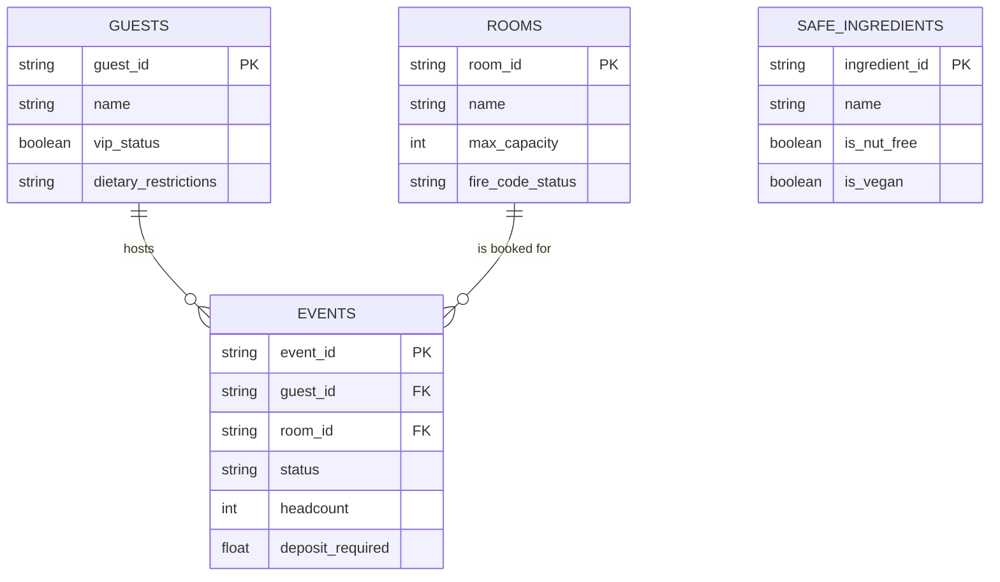

# Aurelia Hotels & Resorts — The BEO Assistant

**A safety-first Model Context Protocol (MCP) server for Banquet Event Order management.**

---

## 1. The Core Problem & Purpose

At **Aurelia Hotels & Resorts**, event coordinators spend countless hours cross-referencing room blocks, catering limits, and ballroom availability. Giving an LLM direct database access previously proved catastrophic — naive models bypassed fire codes, double-booked ballrooms, and approved unfulfillable catering contracts.

To solve this safely, we built the **Banquet Event Order (BEO) Assistant**. Instead of raw database access, our architecture places a secure **MCP Server** in front of a normalized SQLite database. This server enforces strict business logic, authorization boundaries, and human-in-the-loop safeguards before any state change occurs.

---

## 2. Entity-Relationship Diagram (ERD)

The SQLite database (`db/aurelia.db`) is structured to support our core safety traps and operational tools. The Mermaid ERD below is also stored in `db/schema.mermaid`.

---