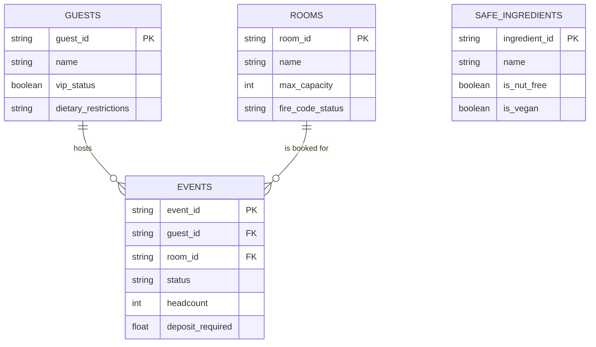

# Aurelia Hotels & Resorts — The BEO Assistant

**A safety-first Model Context Protocol (MCP) server for Banquet Event Order management.**

---

## 1. The Core Problem & Purpose

At **Aurelia Hotels & Resorts**, event coordinators spend countless hours cross-referencing room blocks, catering limits, and ballroom availability. Giving an LLM direct database access previously proved catastrophic — naive models bypassed fire codes, double-booked ballrooms, and approved unfulfillable catering contracts.

To solve this safely, we built the **Banquet Event Order (BEO) Assistant**. Instead of raw database access, our architecture places a secure **MCP Server** in front of a normalized SQLite database. This server enforces strict business logic, authorization boundaries, and human-in-the-loop safeguards before any state change occurs.

---

## 2. Entity-Relationship Diagram (ERD)

The SQLite database (`db/aurelia.db`) is structured to support our core safety traps and operational tools. The Mermaid ERD below is also stored in `db/schema.mermaid`.



---

## 3. Implementation of the 9 Protocol Concerns

Every MCP protocol concern maps to a genuine risk or state-change requirement within Aurelia Hotels.

| # | Concern | Implementation |
|---|---------|-----------------|
| 1 | **Capability Negotiation** | The server declares elicitation support during the `initialize` exchange. If a client connects without elicitation support, the server safely falls back to a read-only mode. |
| 2 | **Notifications** | When a user authenticates as a Senior Director via `authenticate_director`, the server pushes a `tools/list_changed` notification at runtime, instantly exposing high-stakes write tools without requiring a client reconnect. |
| 3 | **Elicitation** | The `confirm_event_booking` tool stops mid-call and triggers `elicitation/create`, pausing execution to ask a human for an explicit confirmation PIN before approving a $20,000 non-refundable deposit. |
| 4 | **Resources** | The Fire Safety and Maximum Room Capacity Policy is exposed as a read-only URI (`aurelia://policies/fire-safety`) via `resources/list` and `resources/read`, letting the model inspect policy text directly rather than wasting tokens on a function call. |
| 5 | **Prompts** | The server exposes a parameterized template (`draft_beo`) via `prompts/list` and `prompts/get`, giving coordinators a canned starting point for new events. |
| 6 | **Transport Choice** | Development and testing use `stdio` locally. For production multi-location hotel chains, the architecture transitions to Streamable HTTP behind secure authentication. |
| 7 | **Progress Tracking** | The `audit_chain_wide_availability` tool runs a batch lookup across 150 chain-wide rooms, sending intermediate progress updates (`send_progress_notification`) so the client is never left blocked without feedback. |
| 8 | **Defensive Tool Design** | Write tools (such as `book_event_room`) enforce strict JSON Schema validation with `additionalProperties: false`, paired with independent server-side database checks that block illegal fire code violations. |
| 9 | **Sampling** | The `draft_custom_menu` tool pulls raw safe-ingredient lists from the database and uses `sampling/createMessage` to loop back to the client's model, reasoning over dietary restrictions (vegan, severe nut allergies) safely. |

---

## 4. Tools & Capabilities

| Tool Name | Type | Requires Elicitation? | Rationale / Fallback Behavior |
|---|---|---|---|
| `audit_chain_wide_availability` | Read-Only | No | Safe batch check across hotel rooms; streams progress updates. |
| `book_event_room` | Write | No | Guarded by strict server-side JSON schema and fire code validation. |
| `authenticate_director` | Write (State Change) | No | Unlocks elevated roles and triggers runtime `tools/list_changed`. |
| `draft_custom_menu` | Read / Compute | No | Uses sampling to have the client model reason over safe database ingredients. |
| `confirm_event_booking` | High-Stakes Write | **Yes** | Gated behind human sign-off for large financial deposits. Falls back to `view_event_deposit_status` if the client lacks elicitation capabilities. |

---

## 5. Getting Started

### Prerequisites

- Python 3.10+
- A valid Groq API Key

### Step-by-Step Execution

**1. Clone or open the repository**

```bash
cd aurelia-beo-assistant
```

**2. Create and activate a virtual environment**

```bash
python -m venv venv

# On Windows:
venv\Scripts\activate

# On macOS/Linux:
source venv/bin/activate
```

**3. Install dependencies**

```bash
pip install -r mcp_server/requirements.txt
pip install groq python-dotenv
```

**4. Configure environment variables**

Create a `.env` file in the root directory:

```
GROQ_API_KEY=your_actual_groq_api_key_here
MODEL_NAME=llama-3.3-70b-versatile
```

**5. Initialize and seed the database**

```bash
python db/setup_db.py
```

**6. Run the end-to-end demo script**

```bash
python agent/client.py
```

The script automatically:

- Executes the fallback demo and handles capability handshakes
- Pulls resources and prompts
- Triggers the fire-code defensive block
- Streams progress tracking updates
- Runs the sampling menu-generation loop
- Pauses to request human confirmation (`APPROVE`) for the high-stakes deposit

---

## Project Structure

```
aurelia-beo-assistant/
├── agent/
│   └── client.py            # End-to-end demo client
├── db/
│   ├── aurelia.db           # SQLite database
│   ├── schema.mermaid       # ERD source
│   ├── ERD.png              # ERD
│   └── setup_db.py          # Database init & seed script
├── mcp_server/
│   └── server.py
├── .env
├── .gitignore
├── commands.txt             # Local environment config
├── README.md
└── requirements.txt
```

---

## License

Internal project — Aurelia Hotels & Resorts. All rights reserved.
