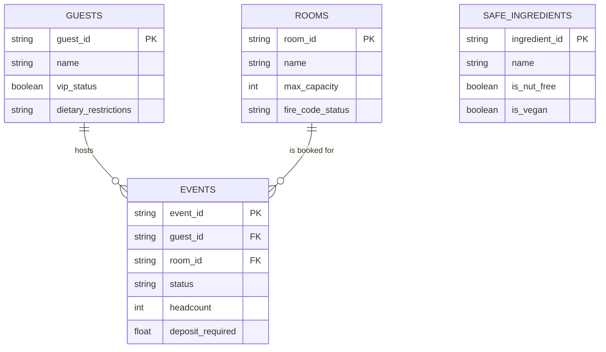

# Aurelia Hotels & Resorts — The BEO Assistant

**A safety-first Model Context Protocol (MCP) server for Banquet Event Order management.**
This repository implements a safety-oriented Banquet Event Order (BEO) assistant built around an MCP server, a SQLite-backed factual domain model, and a retrieval stack that can operate in Naive RAG, Hybrid RAG, and Agentic RAG modes.

**[Click here for the Step-by-Step Live Demo & Quick Start Guide](DEMO.md)**

The code now covers five primary areas:

- An MCP server that exposes resources, prompts, and tools over stdio transport.
- A SQLite schema and seed data for rooms, guests, events, and safe dietary ingredients.
- A client-side demo/agent loop that talks to the MCP server and the Groq LLM API.
- Retrieval, embedding, memory, and evaluation layers for RAG quality and context selection experiments.
- A separate Planning Agent that decomposes goals into task graphs and routes sub-tasks across four planning/search strategies (Plan-and-Solve, Tree of Thoughts, Reflexion, LATS), evaluated against the same live MCP tools.

## Contents

1. [Entity-Relationship Diagram (ERD)](#2-entity-relationship-diagram-erd)
2. [Implementation of the MCP Protocol Surface](#3-implementation-of-the-mcp-protocol-surface)
3. [Tools & Capabilities](#4-tools--capabilities)
4. [Current Architecture](#5-current-architecture)
5. [Data and Retrieval Modules](#6-data-and-retrieval-modules)
6. [Context Strategy Evaluation](#7-context-strategy-evaluation)
7. [Retrieval Architecture Comparison](#8-retrieval-architecture-comparison)
8. [Planning Agent & Multi-Strategy Task Planning](#9-planning-agent--multi-strategy-task-planning)
9. [Local Setup](#local-setup)
10. [Evaluation and Tests](#evaluation-and-tests)
11. [Repository Layout](#repository-layout)
12. [Notes](#notes)

## 2. Entity-Relationship Diagram (ERD)

The SQLite database in the repository is the operational data layer for the agent's safety checks, room-capacity enforcement, guest dietary constraints, event deposit workflow, and retrieval-backed menu reasoning. The current Mermaid schema is stored in [db/schema.mermaid](db/schema.mermaid) and is materialized through [db/setup_db.py](db/setup_db.py) into the local SQLite database file at `db/aurelia.db` when the setup script is run.



## 3. Implementation of the MCP Protocol Surface

The current state of the project maps the MCP concepts to concrete runtime behavior in the server and client.

| # | Concern | Current implementation |
|---|---------|------------------------|
| 1 | **Capability Negotiation** | The client performs an `initialize` handshake through `ClientSession` and then queries the tool list from the server. The connection is intentionally stdio-based and designed to be read-only unless the requested LLM workflow is attached to the server. |
| 2 | **Notifications** | The server's director-authentication path flips server-side state so a higher-privilege tool exposure can be surfaced to the calling client. The low-level notification mechanism is wired through the MCP session and progress callback path. |
| 3 | **Elicitation** | The `confirm_event_booking` tool is conditionally exposed when the server is driven in the high-stakes demo mode and the director role is active. The client-side demo handles approval/rejection input around the high-value deposit flow. |
| 4 | **Resources** | The server exposes a policy resource at `aurelia://policies/fire-safety` through `list_resources()` / `read_resource()`. That resource communicates the room-capacity and fire-safety policy to the model. |
| 5 | **Prompts** | The server exposes a `draft_beo` prompt through `list_prompts()` and `get_prompt()`, returning a BEO-drafting prompt that can accept an `event_id` argument. |
| 6 | **Transport Choice** | The project is using the stdio transport at present, via `mcp.server.stdio` and `mcp.client.stdio`. This is aligned with the local server/client demo and evaluation flow, and is also what both the RAG agent and the Planning Agent spawn their MCP sessions over. |
| 7 | **Progress Tracking** | `audit_chain_wide_availability` loops over the room table and emits progress notifications using the MCP request context progress token while it checks the full room inventory. |
| 8 | **Defensive Tool Design** | The `book_event_room` tool validates JSON arguments against a strict schema and also checks the database-backed room capacities and `fire_code_status` values before any booking write is accepted. |
| 9 | **Sampling** | The menu-generation path relies on the Groq LLM and the safe-ingredient facts from the SQLite store. That flow asks the client-side LLM to reason over the ingredient correctness rather than trusting a free-form text generation path. |

## 4. Tools & Capabilities

The current MCP server register exposes the following operational surface through the `list_tools()` contract.

| Tool Name | Type | Requires Elicitation? | Current Behavior |
|---|---|---|---|
| `audit_chain_wide_availability` | Read / Batch Audit | No | Counts the room inventory and reports sampled room capacity facts while pushing progress notifications. |
| `book_event_room` | Write / Safety Guard | No | Validates request shape and rejects over-capacity requests that violate the fire-code room policy. |
| `authenticate_director` | Write / State Change | No | Changes the director-authenticated server-side state used to gate the high-risk tool surface. |
| `draft_custom_menu` | Read / Compute | No | Pulls safe, database-backed ingredients and routes the result through the client-side reasoning loop. |
| `view_event_deposit_status` | Read | No | Returns the current deposit status and open event bookkeeping facts. |
| `confirm_event_booking` | High-Stakes Write | Yes | Exposed only in the main demonstration flow when the director state and elicitation-capable client context are both active. |

These same six tools are the surface both `agent/client.py` (the RAG/memory agent) and `agent/planning_client.py` (the Planning Agent) call into — the tool implementations live in one place ([mcp_server/server.py](mcp_server/server.py)), and each agent spawns its own short-lived MCP server subprocess against it.

## 5. Current Architecture

The project is not limited to the original one-shot demo surface. The current repository has the following runtime parts:

- MCP server implementation in [mcp_server/server.py](mcp_server/server.py)
- Agent/demo orchestration in [agent/client.py](agent/client.py)
- Planning Agent orchestration in [agent/planning_client.py](agent/planning_client.py), [agent/planning_agent_executor.py](agent/planning_agent_executor.py), and [agent/planning_router.py](agent/planning_router.py) (see [§9](#9-planning-agent--multi-strategy-task-planning))
- Vector embedding and ANN-backed storage in [rag/embedder.py](rag/embedder.py) and [rag/vector_store.py](rag/vector_store.py)
- Retrieval variants in [rag/retrievers.py](rag/retrievers.py)
- Self-RAG verifier in [rag/self_rag.py](rag/self_rag.py)
- Memory system in [memory/short_term.py](memory/short_term.py), [memory/semantic_store.py](memory/semantic_store.py), [memory/episodic_store.py](memory/episodic_store.py), [memory/consolidation.py](memory/consolidation.py), and [memory/router.py](memory/router.py)
- SQLite seed setup in [db/setup_db.py](db/setup_db.py)

## 6. Data and Retrieval Modules

The SQLite database ships with a small domain schema and seed records for BEO operations:

- Rooms with capacity and fire-code safety metadata
- Guests with VIP and dietary restrictions
- Events with status and deposit requirements
- Safe ingredients used for menu generation constraints

The RAG plane includes a sentence-transformers embedding wrapper, a SQLite + BallTree vector store, a BM25 scorer, and retriever classes (`NaiveRAG`, `HybridRAG`, `AgenticRAG`) that expose the main retrieval strategies.

[populate_rag.py](populate_rag.py) is a standalone utility script that seeds a small BEO knowledge-base corpus (the ballroom capacity policy, the VIP guest's dietary constraints, the EVT_999 deposit fact, and the safe-ingredients list) into a `VectorStore`. It is the same corpus that [retrieval_eval/evaluate_rag.py](retrieval_eval/evaluate_rag.py) queries against when scoring Naive/Hybrid/Agentic RAG. It is independent of the live `agent/client.py` demo loop, which opens its own (separately initialized) vector store at `db/rag_store.sqlite`.

## 7. Context Strategy Evaluation

The repository ships a deterministic evaluator that rewinds the full BEO recall suite through the four pruning strategies and records objective evidence for the production context choice.

### Commands

```bash
python context_eval/evaluate.py
```

That command loads the test corpus from the suite file, applies the four context-selection strategies, checks whether the critical operational fact survives after pruning, and writes a markdown comparison table to `context_eval/comparison_table.md`.

The scorecard has the required columns:

- Task accuracy after pruning
- Tokens consumed
- Latency

This table is the artifact that justifies whatever production context strategy the team selects after the evidence is collected.

## 8. Retrieval Architecture Comparison

We evaluated three retrieval architectures (Naive RAG, Hybrid Search, and Agentic RAG) across our domain-specific test questions (`q1_capacity_trap`, `q2_allergy_trap`, `q3_deposit_trap`, and `q4_general_room`):

| Architecture | Accuracy (Test Set) | Avg. Latency / Query | Self-RAG Verification Status |
| :--- | :--- | :--- | :--- |
| **Naive RAG** (Baseline Vector Search) | 4/4 (Pass) | ~0.06s | Mostly Pass / Pass |
| **Hybrid Search** (Vector + BM25) | 4/4 (Pass) | ~0.07s | Pass / Mix (Pass/Fail) |
| **Agentic RAG** (Multi-step Reasoning) | 4/4 (Pass) | ~1.80s | Pass / Mix (Pass/Fail) |

### **Justification & Architecture Selection:**
* **Performance Analysis:** All three architectures successfully achieved a **Pass** in accuracy across our core test questions. However, **Naive RAG** and **Hybrid Search** maintained extremely fast response times (averaging around `0.06s` to `0.07s`), whereas **Agentic RAG** suffered from a significantly higher latency (reaching up to `4.97s` on complex queries due to LLM reasoning loops).
* **Final Ship Decision:** We ship **Hybrid Search** as our default production retrieval layer. It provides robust keyword and vector coverage at minimal latency, avoiding the heavy performance overhead of multi-step agentic loops during live front-desk operations.

## 9. Planning Agent & Multi-Strategy Task Planning

Alongside the RAG/memory agent, the repository has a second, independent agent that decomposes a natural-language goal into sub-tasks and executes them against the same six MCP tools, then audits which planning algorithm each sub-task *should* have used.

### 9.1 Two entry points, one MCP surface

- [agent/client.py](agent/client.py) — the original RAG/memory demo agent.
- [agent/planning_client.py](agent/planning_client.py) — the Planning Agent. It is a **deliberately separate process**: its own CLI, its own MCP stdio session (via [agent/planning_agent_executor.py](agent/planning_agent_executor.py)), and it never imports or calls into `agent/client.py`. The two agents share only the `mcp_server/` code and the on-disk `db/aurelia.db` — each spawns its own short-lived server subprocess, and both can run at once in separate terminals without conflicting.

### 9.2 Planning strategies

`PlanningAgentExecutor` runs a goal through one of two grounded modes, both backed by `ChatGroq` (`MODEL_NAME`, default `llama-3.3-70b-versatile`):

- **`decomposition` (default):** builds a full task DAG up front (`decompose_goal_grounded`), validates it (acyclicity, id/dependency checks via NetworkX + Pydantic), then executes it step by step against the live MCP tools (`execute_plan_against_mcp`).
- **`dynamic`:** interleaves planning and observation one step at a time (`dynamic_decomposition_grounded`), capped by `--max-steps`.

Underneath both, [planning/planning_lab/algorithms/](planning/planning_lab/algorithms) implements the full set of planning/search techniques the project explores:

| Algorithm | Module | Idea |
|---|---|---|
| Decomposition (static DAG) | `decomposition.py` | Upfront task-graph generation, topological scheduling, parallel-safe batches |
| Dynamic decomposition | `dynamic_decomposition.py` | Plan one step, observe the tool result, then plan the next step |
| Plan-and-Solve (PS) | `plan_and_solve.py` | Single explicit plan phase followed by a solution phase — lowest cost, linear tasks |
| Tree of Thoughts (ToT) | `tree_of_thoughts.py` | Bounded generate/evaluate/beam-search over candidate states |
| Self-Refine | `self_refine.py` | One draft, one critique pass, one revision |
| Reflexion | `reflexion.py` | Retries a task across trials, carrying bounded verbal episodic memory of prior failures |
| LATS | `lats.py` | Compact MCTS loop — action generation, a value function, external environment feedback, branch reflection, UCT selection, value backpropagation |
| Environment | `environment.py` | Swappable external feedback interface used by Reflexion/LATS |

Demo scripts wiring each technique to the actual Aurelia domain (booking, breakout-room selection, conference planning) live in [planning/aurelia_adapters/](planning/aurelia_adapters): `booking_reflexion_demo.py`, `breakout_tot_demo.py`, `conference_dag_demo.py`, and `conference_dynamic_demo.py`. [planning/README.md](planning/README.md) documents the original standalone lab (CLI, exercises) that these algorithms were built from.

### 9.3 Planning Router (audit layer)

[agent/planning_router.py](agent/planning_router.py) implements a `PlanningRouter` that inspects each executed sub-task's instruction text (allergy/VIP signals, combinatorial-selection signals, capacity-violation/retry signals, arithmetic/deterministic signals) and reports, with a confidence score and rationale, which of the four algorithms (PS / ToT / Reflexion / LATS) *should* have handled it — e.g. an allergy- or VIP-related menu step routes to LATS, a "select K distinct rooms" step routes to ToT, a capacity-retry step routes to Reflexion, and deposit/budget arithmetic routes to PS by default. This is an **advisory audit trail only**: it runs after execution and does not change which code path actually ran the step. `agent/planning_client.py` prints this audit for every step of a run.

### 9.4 Planning comparison table

[planning_eval/evaluate_planning.py](planning_eval/evaluate_planning.py) runs the full comparison suite ([planning_eval/test_suite.json](planning_eval/test_suite.json)) across Static DAG, Dynamic Decomposition, Plan-and-Solve, Tree of Thoughts, Reflexion, and LATS, instrumenting real LLM-call counts, estimated tokens, latency, and an approximate Groq cost per algorithm. It writes a raw run trace to `planning/artifacts/`, refreshes [planning_eval/comparison_table.md](planning_eval/comparison_table.md), and re-embeds the table below between the `PLANNING_EVAL_TABLE` markers in this README.

```bash
python planning_eval/evaluate_planning.py
```

<!-- PLANNING_EVAL_TABLE_START -->
| Algorithm | Accuracy | LLM Calls | Tokens | Avg Latency (s) | Est. Cost (USD) |
|---|---:|---:|---:|---:|---:|
| Static DAG | 75.0% (3/4) | 17 | 4481 | 10.077 | $0.0031 |
| Dynamic Decomposition | 25.0% (1/4) | 25 | 11011 | 22.906 | $0.0076 |
| Plan-and-Solve | 75.0% (3/4) | 4 | 1343 | 2.078 | $0.0009 |
| Tree of Thoughts | 50.0% (2/4) | 12 | 849 | 6.354 | $0.0006 |
| Reflexion | 75.0% (3/4) | 9 | 2032 | 3.167 | $0.0014 |
| LATS | 50.0% (2/4) | 5 | 486 | 3.514 | $0.0003 |
<!-- PLANNING_EVAL_TABLE_END -->

## Local Setup

### Prerequisites

- Python 3.10+
- A Groq API key and an environment that can reach the Groq service (used by both `agent/client.py` and the Planning Agent)

### Install

```bash
python -m venv .venv
source .venv/bin/activate
pip install -r requirements.txt
```

`requirements.txt` at the repo root already includes everything needed to run `mcp_server/`, `agent/` (both the RAG agent and the Planning Agent), and `planning/` together — including the Planning Agent's `langchain-groq`, `networkx`, and `pydantic` dependencies. [planning/requirements.txt](planning/requirements.txt) is kept only as an empty placeholder so a stray `pip install -r planning/requirements.txt` doesn't error out; you don't need to run it separately.

### Environment variables

Create a root-level `.env` file with at least the following values:

```bash
GROQ_API_KEY=your_groq_api_key
MODEL_NAME=llama-3.3-70b-versatile
EMBEDDING_MODEL=sentence-transformers/all-MiniLM-L6-v2
```

### Initialize the database

```bash
python db/setup_db.py
```

This creates and seeds the relational store at `db/aurelia.db` (rooms, guests, events, safe ingredients) used by every MCP tool.

### Run the demo client

```bash
python agent/client.py
```

The agent client drives the MCP server over stdio and exercises the tools, prompts, policies, and tool-calling loop.

### Run the planning agent

The Planning Agent is a **separate entry point**, [agent/planning_client.py](agent/planning_client.py). It runs
independently of `agent/client.py` — a different process with its own MCP stdio session — but shares the same
underlying resources: it spawns the same `mcp_server/` (`python -m mcp_server.server`) and that server reads/writes
the same on-disk `db/aurelia.db`. Nothing in `agent/client.py` is imported, called, or modified to make this work.

```bash
# Run with the built-in demo goal
python agent/planning_client.py

# Run with your own goal
python agent/planning_client.py "Plan a 2-day offsite for 60 people, confirm the deposit for EVT_999."

# Interleave planning and execution one step at a time instead of building the full DAG up front
python agent/planning_client.py "<goal>" --mode dynamic --max-steps 8
```

Both agents can be run separately, or at the same time in two terminals — each opens its own MCP server subprocess
and neither one depends on the other being started first.

## Evaluation and Tests

Several subprojects use deterministic evaluation and unittest/pytest-style regression coverage:

```bash
python context_eval/evaluate.py           # context-pruning strategy comparison (§7)
python retrieval_eval/evaluate_rag.py      # Naive vs Hybrid vs Agentic RAG comparison (§8)
python planning_eval/evaluate_planning.py  # planning-algorithm comparison (§9.4)
python -m unittest discover
```

The context evaluation flow compares strategy outputs and writes artifacts to `context_eval/`. The retrieval test suite validates the vector store and retriever implementations (`rag/tests/`). Test coverage also lives in `agent/tests/` (planning router), `memory/tests/`, and `planning/tests/`.

## Repository Layout

```text
agent/
  client.py                    # RAG/memory agent entry point
  planning_client.py           # Planning Agent entry point (separate process, shared resources)
  planning_agent_executor.py   # Connects the Planning Agent to the MCP server
  planning_router.py           # Advisory PS/ToT/Reflexion/LATS routing audit
  tests/
context_eval/                  # Context-pruning strategy evaluator (§7)
db/
  schema.mermaid
  setup_db.py                  # Seeds db/aurelia.db
mcp_server/
  server.py                    # MCP tools, resources, and prompts
memory/                        # Short-term, semantic, episodic memory + router
planning/
  planning_lab/                # PS, ToT, Reflexion, LATS, decomposition algorithms
  aurelia_adapters/            # Domain demo scripts wiring algorithms to Aurelia
  README.md                    # Original standalone planning-lab documentation
planning_eval/                 # Planning-algorithm comparison evaluator (§9.4)
rag/                            # Embedder, vector store, retrievers, Self-RAG
retrieval_eval/                # Naive/Hybrid/Agentic RAG evaluator (§8)
populate_rag.py                # Seeds a demo knowledge base for retrieval_eval
README.md
requirements.txt
```

## Notes

This repository is configured as a research-and-demo codebase rather than a packaged API service. The dependencies and runtime surface are intentionally close to the current Python implementation, including the Groq integration used by both agents and the retrieval components.
